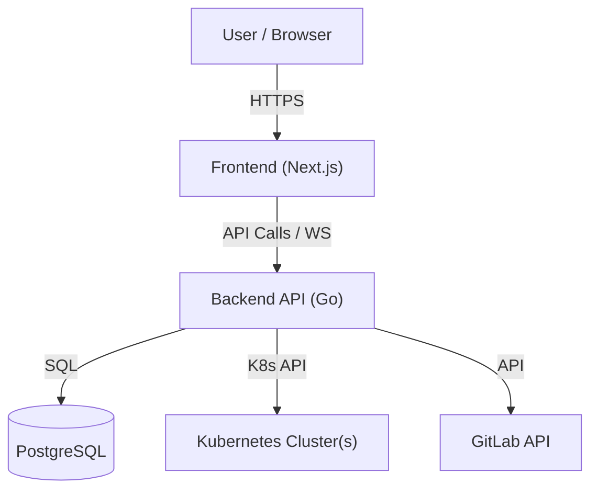

# Architecture Overview

**Cloud Sentinel** is a modern, unified Kubernetes dashboard designed for DevOps engineers to manage multiple clusters, visualize workloads, and integrate closely with GitLab for GitOps workflows.

## System Components

The system consists of three main components:

1.  **Frontend**: A Next.js (React) application.
2.  **Backend**: A Go (Golang) REST API.
3.  **Database**: PostgreSQL for persistent storage of user configs and audit logs.

## 1. Frontend Layer
- **Framework**: Next.js 14+ (App Router).
- **Styling**: Tailwind CSS with Shadcn UI components.
- **State Management**: React Hooks & Context.
- **Communication**:
    - **REST**: Standard API calls for fetching resource lists.
    - **WebSockets**: Real-time streaming for Logs (`/api/v1/kube/logs`) and Terminal Exec (`/api/v1/kube/exec`).

## 2. Backend Layer
- **Framework**: Gin Gonic (High-performance HTTP web framework).
- **Language**: Go 1.22+.
- **Key Modules**:
    - `api/`: REST handlers for Kubernetes resources (Pods, Deployments, CRDs, etc.).
    - `auth/`: OIDC authentication flow and JWT token generation.
    - `db/`: Database connection and ORM models using GORM.
    - `k8s/`: Wrapper around `client-go` for interacting with K8s clusters.

## 3. Data Storage (PostgreSQL)
The application handles minimal state, delegating most source-of-truth to Kubernetes itself. However, it persists:
- **Users**: User profiles and authentication context.
- **Audit Logs**: Records of critical actions (e.g., Delete Resource, Cordon Node).
- **Cluster Mappings**: Context configuration for multi-cluster management.
- **GitLab Config**: Access tokens and project mappings for GitOps integration.

## 4. Kubernetes Integration
- **Client**: Uses official `k8s.io/client-go`.
- **Dynamic Client**: Utilized for CRDs and resources where the schema is not known at compile time.
- **Multi-Context**: Supports switching between different kubeconfig contexts dynamically per request.

## 5. Security Architecture
- **Authentication**: OIDC (OpenID Connect) integration with providers like GitLab, Google, etc.
- **Authorization**:
    - Backend validates valid JWT in `Authorization` header.
    - Kubernetes RBAC is respected by using the underlying kubeconfig credentials (impersonation or direct use depending on deployment).
- **Sensitive Data**: Kubeconfigs and Secrets are never exposed to the frontend; the backend acts as a secure proxy.
