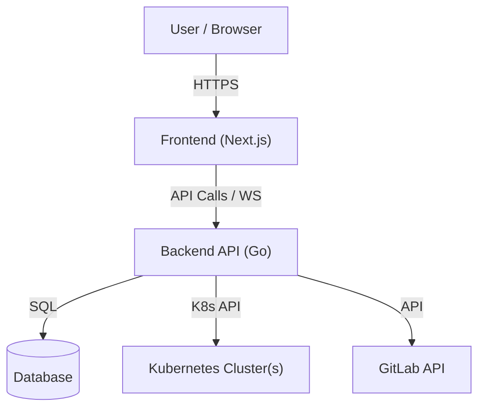

# Architecture Overview

**Cloud Sentinel** is a modern, unified Kubernetes dashboard designed for DevOps engineers to manage multiple clusters, visualize workloads, and integrate closely with GitLab for GitOps workflows.

## System Components

The system consists of three main components:

1.  **Frontend**: A Next.js (React) application.
2.  **Backend**: A Go (Golang) REST API.
3.  **Database**: PostgreSQL (recommended), MySQL, or SQLite for persistent storage.

## 1. Frontend Layer
- **Framework**: React with Vite.
- **Styling**: Tailwind CSS with Shadcn UI components.
- **State Management**: React Hooks & Context.
- **Subpath Support**: Can be hosted on custom subpaths via `CLOUD_SENTINEL_K8S_BASE`.
- **Communication**:
    - **REST**: Standard API calls for fetching resource lists.
    - **WebSockets**: Real-time streaming for Logs (`/api/v1/kube/logs`) and Terminal Exec (`/api/v1/kube/exec`).

## 2. Backend Layer
- **Framework**: Gin Gonic (High-performance HTTP web framework).
- **Language**: Go 1.25+.
- **Key Modules**:
    - `api/`: REST handlers for Kubernetes resources (Pods, Deployments, CRDs, etc.).
    - `auth/`: OIDC authentication flow and JWT token generation.
    - `pkg/models/`: GORM models with centralized database initialization.
    - `pkg/middleware/`: Custom middleware for metrics, logging, and CORS.
    - `pkg/utils/`: Utility functions for HTML injection and helper methods.
- **Middleware Stack** (in order):
    1. Metrics (Prometheus instrumentation)
    2. Recovery (panic recovery)
    3. Logger (klog-based request logging)
    4. CORS (custom CORS handling)

## 3. Data Storage
The application supports **PostgreSQL** (recommended), **MySQL**, and **SQLite** as database backends. It persists:
- **Apps & Access Control**: Application registry and user-app access mapping.
- **Users**: User profiles with support for OAuth and local authentication.
- **User Identities**: Multi-provider authentication support (OIDC, GitLab, etc.).
- **Audit Logs**: Records of critical actions (e.g., Delete Resource, Cordon Node).
- **Cluster Mappings**: Context configuration and display names for multi-cluster management.
- **GitLab Config**: Access tokens and project mappings for GitOps integration.
- **Kubeconfig Management**: User-uploaded kubeconfig files and EKS cluster configurations.

### Model Structure
All models inherit from a base `Model` struct with common fields (`ID`, `CreatedAt`, `UpdatedAt`), ensuring consistency across the database schema.

## 4. Kubernetes Integration
- **Client**: Uses official `k8s.io/client-go`.
- **Dynamic Client**: Utilized for CRDs and resources where the schema is not known at compile time.
- **Multi-Context**: Supports switching between different kubeconfig contexts dynamically per request.

## 5. Security Architecture
- **Authentication**: OIDC (OpenID Connect) integration with providers like GitLab, Google, etc.
- **Authorization**:
    - Backend validates valid JWT in `Authorization` header.
    - Kubernetes RBAC is respected by using the underlying kubeconfig credentials (impersonation or direct use depending on deployment).
- **Sensitive Data**: Kubeconfigs and Secrets are never exposed to the frontend; the backend acts as a secure proxy.

## 6. Resource Action Flow
When a user triggers an action (e.g., Restart Deployment or Suspend CronJob):
1.  **Frontend**: Sends a POST/PATCH request to the specific action endpoint (e.g., `/api/v1/kube/workloads/deployments/restart`).
2.  **Backend**:
    - Validates the request and user permissions.
    - Uses the `dynamic client` or `client-go` to apply the transformation (e.g., updating a `rollout.kubernetes.io/restartedAt` annotation).
    - Records the action in the **Audit Log** (PostgreSQL).
3.  **Kubernetes**: Reconciles the resource based on the updated specification.

## 7. CI/CD & Delivery
The project follows an automated delivery pipeline:
- **Versioning**: Managed by `release-please` based on commit types (feat, fix, etc.).
- **Build**: GitHub Actions triggers on new tags to build multi-arch Docker images (`linux/amd64`, `linux/arm64`).
- **Registry**: Images are stored in **GitHub Container Registry (GHCR)**.
- **Environment**: Configuration is managed via environment variables and `.env` files, ensuring secrets are handled securely outside the code.

